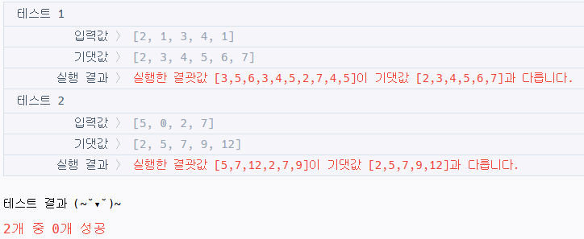
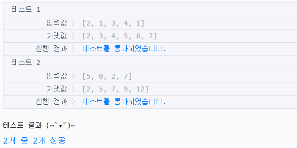
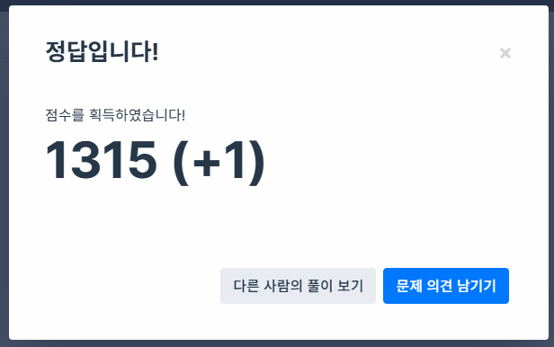
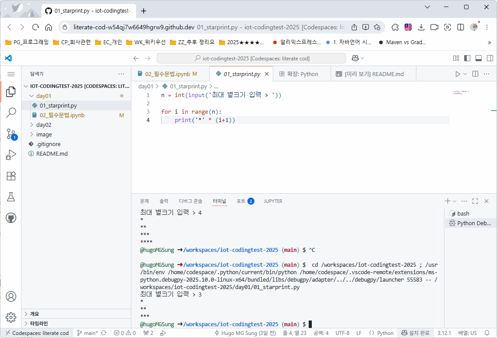
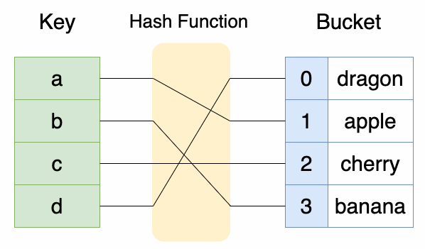
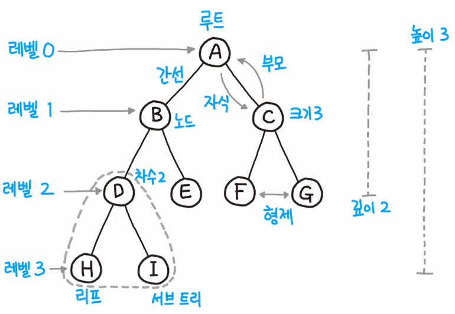

# IoT-CodingTest
IoT 개발자 코딩테스트 준비 Repository

## 1. 💻 코딩테스트 전 에디터 선택 참고

### ✅ VS Code 사용 시 유의사항

- 다양한 확장 프로그램(Plugins) 지원으로 편리하지만,
**과도하게 플러그인을 설치할 경우** 메모리 사용량이 증가하여
저사양 PC에서 **성능 저하**가 발생할 수 있음.

### 🛠️ 대체 가능한 경량 에디터
1. [VSCodium](https://vscodium.com/) 
    - VS Code의 오픈소스 버전
    - 마이크로소프트의 추적 기능 제거
    - VS Code와 동일한 UI/기능 제공

2. [Cursor AI](https://cursor.com/)
    - ChatGPT 기반 AI 코딩 지원
    - 바이브 코딩(Vibe Coding): AI가 코드 맥락 이해 & 자동 생성
    - 코드 리뷰, 디버깅 보조, 문맥 기반 설명 기능 탑재
    - 일부 기능은 유료 플랜

3. VS Code + MCP 플러그인 조합
    - VS Code에 MCP 플러그인 설치 시
    - Cursor와 유사한 AI 코딩 보조 기능 사용 가능
    - 기존 VS Code 사용자는 별도 에디터 없이도 AI 기능 활용 가능

#### 2. 코딩테스트 관련 참고 
##### 🎥 코딩테스트 대비 추천 유튜브 강의
| 강의 제목                                                                                                              | 설명                                           | 링크                                                                                             |
| ------------------------------------------------------------------------------------------------------------------ | -------------------------------------------- | ---------------------------------------------------------------------------------------------- |
| **[이코테 – 코딩 테스트 출제 경향 분석 및 파이썬]** | 출제 경향 분석 + 파이썬 기본기 설명   📌 전반적인 개념 학습용    | 🔗 [바로가기](https://www.youtube.com/watch?v=m-9pAwq1o3w&list=PLRx0vPvlEmdAghTr5mXQxGpHjWqSz0dgC) |
| **[Do It 파이썬 코딩 테스트 (입문)]** | 파이썬 문법 + 알고리즘 기초   📌 초보자에게 추천            | 🔗 [바로가기](https://www.youtube.com/watch?v=m2KpGo_-sGI&list=PLFgS-xIWwNVULwx1VA5IvpSqsXScpviN-) |
| **[Do It 파이썬 코딩 테스트 (백준)]** | 백준 중심의 실전 문제 풀이   📌 백준 풀이 익숙해지고 싶은 경우 추천 | 🔗 [바로가기](https://www.youtube.com/watch?v=cJ9xdW_hqR4&list=PLlV7zJmoG4XJfK8vVL2E2NX8ej73vjNlh) |
| **[프로그래머스 코딩 테스트 – 파이썬]** | 프로그래머스 문제 풀이 중심   📌 기업별 코딩 테스트 실전 연습용    | 🔗 [바로가기](https://www.youtube.com/watch?v=XncTU-4i1KI&list=PLFgS-xIWwNVX-zm4m6suWC9d7Ua9z7fuT) |

### 3. 📚 코딩 테스트 무료 강의 & 자료 추천
| 플랫폼/자료                            | 설명                                                  | 링크                                                                                                                                                                                                                                       |
| --------------------------------- | --------------------------------------------------- | ---------------------------------------------------------------------------------------------------------------------------------------------------------------------------------------------------------------------------------------- |
| **네이버 카페 – 드림코딩 테스트**             | 다양한 언어별 문제 풀이 & 최신 기업 정보 공유   📌 가입 후 이용 가능      | [🔗 cafe.naver.com/dremdeveloper](https://cafe.naver.com/dremdeveloper)                                                                                                                                                                  |
| **C++ 인프런 무료 강의**                 | C++ 기반의 코딩 테스트 입문 강의   기초부터 실전까지 구성              | [🔗 바로가기](https://www.inflearn.com/course/cpp-%EC%BD%94%EB%94%A9%ED%85%8C%EC%8A%A4%ED%8A%B8-%ED%95%A9%EA%B2%A9?inst=a72dfff8&utm_campaign=inflearn_%ED%8A%B8%EB%9E%98%ED%94%BD_promotion-link&utm_medium=referral&utm_source=instructor) |
| **위키독스 – 파이썬 알고리즘 인터뷰**           | 무료로 제공되는 온라인 알고리즘 책   📌 실전 문제 중심으로 설명           | [🔗 wikidocs.net/book/13314](https://wikidocs.net/book/13314)                                                                                                                                                                            |
| **GitHub – 드림 개발자 Python 코테 자료집** | 파이썬 기반 코딩 테스트 정리 자료   📌 알고리즘, 자료구조, 실전 문제 풀이 포함 | [🔗 github.com/dremdeveloper/codingtest\_python](https://github.com/dremdeveloper/codingtest_python)                                                                                                                                     |
## 4. 🚀 코딩테스트 시작!
### ✅ 사용 가능한 주요 언어
- C, C++, Java, JavaScript, Python(3), `Python(3)`

### 🌐 주요 코딩 테스트 사이트
| 플랫폼                                                                                 | 특징                                                                   | 링크                                                                               |
| ----------------------------------------------------------------------------------- | -------------------------------------------------------------------- | -------------------------------------------------------------------------------- |
| **[프로그래머스]** | 📌 **카카오 등 대기업의 블라인드 테스트**에 가장 많이 사용   실전 코딩 테스트와 유사한 인터페이스 제공   프로그래머스 인증시험도 채용시 활용(CPP, PCSQL)    | [🔗 바로가기](https://school.programmers.co.kr/learn/challenges?order=recent&page=1) |
| **[백준 (BOJ)]**                                            | 📌 국내에서 가장 유명한 알고리즘 문제 풀이 사이트   로컬 코딩 → 제출 방식, 다양한 커뮤니티와 풀이 참고 가능 | [🔗 바로가기](https://www.acmicpc.net/)                                              |
| **[삼성 SW Expert Academy]**   | 📌 **삼성 채용 및 SW 역량 테스트 공식 플랫폼**   연습 문제 및 기출 풀이 가능                | [🔗 바로가기](https://swexpertacademy.com/main/capacityTest/main.do)                 |

### 🧭 코딩테스트 준비 가이드
#### 🗣️ 언어 선택 기준
- 기업 성향 또는 산업군에 따라 선호 언어가 다름

| 구분                      | 대표 기업                                                | 선호 언어                                               |
| ----------------------- | ---------------------------------------------------- | --------------------------------------------------- |
| 💻 **대기업 / 제조 / 임베디드**  | 삼성전자, LG전자, 한화시스템, LIG넥스원, 현대오토에버, 넥슨, NC소프트, 크래프톤 등 | **C++ / Java** ※ 실무는 C 중심이지만, **코딩 테스트는 C++ 권장** |
| 🏢 **IT 플랫폼 / 대형 스타트업** | 카카오, 네이버, 당근마켓, 배달의민족, 무신사, 직방, 쿠팡, 토스 등             | **Python / Java**                                   |
| 🌐 **프론트엔드 중심 기업**      | 다양한 웹·앱 서비스 스타트업                                     | **JavaScript**                                      |

- 일반적인 IT 직군(웹, 백엔드, 서비스 개발 등) → Python 3 사용률이 가장 높음
    - 코드가 짧고 가독성 우수
    - 내장 자료구조 활용 용이 (list, set, dict 등)
    - 빠른 작성과 디버깅에 유리
> ✅ 정답은 없음
자신이 가장 익숙한 언어로 문제 해결 능력을 키우는 것이 핵심

### 🧠 문제 분석 연습하기
문제를 단순히 읽고 넘어가지 말고, 아래 **4단계로 구조적으로 분석하는 습관**이 중요함!

1. 🔍 문제 쪼개기
    - 문제를 **동작 단위(기능 단위)**로 분해해서 이해
    - 예: 입력 → 조건 처리 → 결과 출력 순서로 단계 나누기

2. 📌 제약 사항 파악
    - 문제에서 주어진 조건, 제한 사항을 꼼꼼히 확인
    - 예: 최대 값, 음수 가능 여부, 연산 횟수 제한 등
        → 알고리즘 선택과 최적화 여부 판단 기준

3. 🔢 입력값 파악 → 시간복잡도 판단
    - 입력 범위를 보고 최악의 경우 연산 횟수 추정
    - 예: 
        - 1 ≤ N ≤ 1,000 → O(N²)도 가능
        - 1 ≤ N ≤ 100,000 → O(N log N) 이하로 제한 필요
    
4. 💡 핵심 키워드 도출
    - 문제에서 알고리즘 유형을 암시하는 단어 찾기
    - 예:
        - "최단 거리" → 다익스트라, BFS
        - "순열, 조합" → 백트래킹
        - "최댓값/최솟값" → 이분 탐색, 우선순위 큐

> 📌 문제를 잘 쪼개고 구조적으로 분석하면, **어떤 알고리즘을 써야 할지 자동으로 보이게** 됨!

#### 💻 프로그래머스 사용 가이드 
- ✅ 카카오를 포함한 많은 기업에서 사용하는 대표 코딩 테스트 플랫폼
- ⚠️ 자동완성 기능 없음!
→ 평소에 VS Code 자동완성에 익숙한 사람이라면, 프로그래머스 환경에서 연습 필수

#### 📌 프로그래머스 이용 방법
- 프로그래머스 접속
- 회원가입 및 로그인
- 상단 메뉴 → ‘코딩 테스트 연습’ 클릭
- 원하는 난이도 또는 기업별 문제 선택
- 스킬 체크 모드도 있음 (실제 테스트와 유사)
- 문제풀이 에디터 진입
- 예제 실행 가능
- 힌트, 제한사항, 입출력 예시 확인하며 풀이

## 5. 알고리즘 효율
### ⏱️ 시간 복잡도 (Time Complexity)
- 시간 복잡도란, **입력 크기(N)**에 따라 알고리즘의 실행 시간이 얼마나 증가하는지를 수학적으로 표현한 개념

- 문제의 제한사항(예: N ≤ 100,000)을 보고 적절한 알고리즘을 선택하는 데 핵심 기준이 됨

> 📌 코딩 테스트에선 정답보다 **시간 안에 푸는 것**이 훨씬 중요!

### 🧮 복잡도

| 구분            | 설명                           |
| ------------- | ---------------------------- |
| ⏰ **시간 복잡도**  | 문제를 해결하는 데 **걸리는 시간**을 측정    |
| 💾 **공간 복잡도** | 문제를 해결하는 데 **필요한 메모리 양**을 측정 |

### 🔍 시간 복잡도의 기준 – 항상 최악의 경우 기준 
- 알고리즘은 상황에 따라 실행 시간이 달라질 수 있음

- 하지만 코딩 테스트 및 면접에서는 항상 **최악의 경우(Worst Case)**를 기준으로 시간 복잡도를 분석함

| 케이스          | 설명                                   |
| ------------ | ------------------------------------ |
| ✅ **최고(O)**  | 가장 빠른 실행 상황 (거의 안 씀)                 |
| ⚖️ **보통(Θ)** | 평균적인 실행 시간                           |
| ❌ **최악(Ω)**  | 가장 느린 상황 → **코딩 테스트에서는 이것 기준으로 판단!** |

### ✅ 입력 크기와 시간 복잡도 예시
| 입력 크기 N       | 적절한 시간 복잡도           |
| ------------- | -------------------- |
| N ≤ 500       | O(N³) 가능             |
| N ≤ 1,000     | O(N²) 이하             |
| N ≤ 10,000    | O(N log N) 이하        |
| N ≤ 100,000   | O(N) 이하              |
| N ≥ 1,000,000 | O(log N), O(1) 수준 필요 |

### ⏱️ 시간복잡도별 최대 연산 횟수 (1초 기준)

| 순번 | 시간복잡도    | 최대 연산 횟수 (1초당) | 비고                                                         |
|------|---------------|------------------------|--------------------------------------------------------------|
| 1    | O(log n)      | 1,000,000,000          | 1중 for문, 중간 연산을 빠지는 경우가 매우 많은 경우 (예: 369) |
| 2    | O(n)          | 20,000,000             | 1차 반복문 사용 / 반복문 하나 사용                           |
| 3    | O(n log n)    | 1,000,000              | 2차 반복문에서 하나가 log n 횟수로 연산                      |
| 4    | O(n²)         | 50,000                 | 2중 반복문 (예: 버블 정렬, 선택 정렬 등)                     |
| 5    | O(n³)         | 5,000                  | 3중 반복문 (예: 플로이드 워셜 등)                            |
| 6    | O(2ⁿ)         | 25                     | 재귀 백트래킹 (예: 부분집합, 순열 등)                        |
| 7    | O(n!)         | 10                     | 모든 경우의 수 탐색 (예: 순열, 외판원 문제 등)               |

> ✅ 기준: 1초당 약 1억 번 연산이 가능하다고 가정

#### 시간 복잡도 계산
- 실제 별찍기는 $O(n)$. 하지만 수학적으로 계산해보면 50(n2 ) 나올 수 있음
- 박테리아 계산도 16개를 매년 하나씩 줄어드면 16년이 걸릴 것을 예상(n)
    - 반씩 줄면 횟수가 더 많이 주는 것을 유추할 수 있음

--- 

## Day 2 - 코딩테스트 정복 시작! 🧩    
### 📘 리스트(List) = 배열 대체
- 파이썬에서는 배열이 없고, 리스트로 대체하여 사용
- 리스트는 동적 배열로 크기 제한 없이 유연하게 사용 가능
- [노트북 바로가기](./day02/01_배열.ipynb)

### 🧪 프로그래머스 실습 #1
1. `solution.py` 파일에 풀이 코드 작성
2. `코드 실행`으로 기본 테스트 진행
    - ❌ 실패 화면
        
    - ✅ 성공 화면
        
3. `제출 후 채점하기` → 총 9개 테스트케이스
    - 전부 통과해야 정답 인정!
        
4. **다른 사람 풀이 열람 가능 (점수 차감 없음)**

#### 모의 테스트
1. [두 개 뽑아서 더하기](https://school.programmers.co.kr/learn/courses/30/lessons/68644) 
2. [방문 길이](https://school.programmers.co.kr/learn/courses/30/lessons/49994)

### 스택
- LIFO: 맨 나중에 추가한 데이터가 가장 먼저 출력되는 구조
- push() : 데이터 삽입. 쌓여있는 데이터 마지막에 추가
- pop() : 데이터 추출. 쌓영있는 데이터 마지막에서 추출
- [링크](./day02/02_스택.ipynb)

--- 

## 3일차
### 🧪 프로그래머스 실습 #2
### 깃헙 팁
- https://github.com/hugoMGSung 주소에 com -> dev
    - 브라우저 상에서 온라인 VS Code가 실행
    - 로컬 VS Code와 동일하게 사용가능
    - 처음 Ctrl + F5로 실행, CodeSpace 설정, CPU 2Core, 8Gb... 등 선택하고 코드스페이스 생성

    

### 스택
- 몸풀기 문제, 모의 테스트
- 제출 후 체점하기에서 print()문 제거 또는 주석처리할 것(효율성 테스트)
- [링크](./day03/01_스택.ipynb)

### 큐
- FIFO : 맨 먼저 삽입한 데이터가 가장 먼저 출력되는 구조
- enQueue() : 데이터 삽입
- deQueue() : 데이터 추출
- [링크](./day03/02_큐.ipynb)

--

## 4일차

### 해시
- 딕셔너리와 동일. 키와 값의 쌍

    

- 비밀번호 관리, 데이터베이스 인덱스(해시 + B트리), 블록체인 등에서 사용

#### 해시함수
- 키를 통해서 값의 인덱스를 찾아주는 함수
- 해시함수를 직접 구현하라는 문제는 거의 없음
- 딕셔너리를 사용하면 해시와 동일하므로 해시를 대체 사용
- 고전적으로 나눗셈법, 곱셈법, 문자열해싱 사용해서 해시함수 구현
- UUID : 32자리 16진수 char + 4개 `-` 를 포함한 구조. 해시를 통해서 생성
- 해시함수에서 다른 키에 대해서 같은 인덱스의 충돌이 발생할 수 있음

#### 문제풀이
- [링크](./day04/01_해시.ipynb)

### 트리
 

#### 문제풀이
- [링크]()
